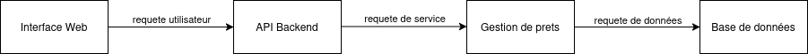
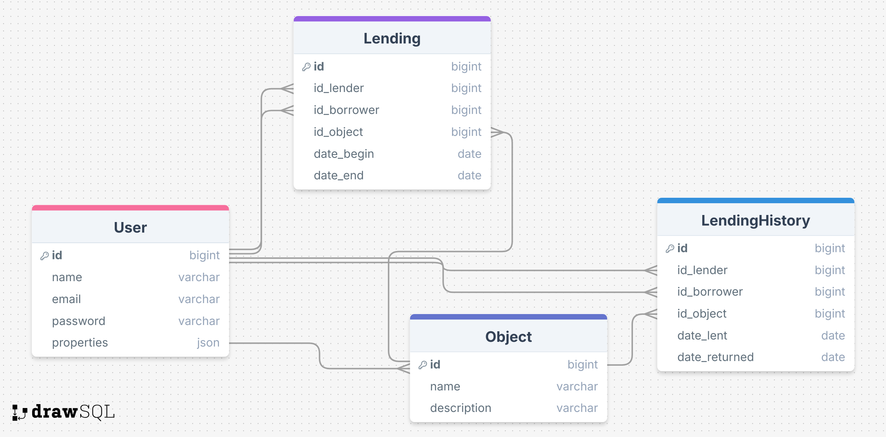

# Document d'Architecture Logicielle
## 1. Contexte
Ce document présente les décisions architecturales du projet. Il décrit les choix de conception, les composants principaux, et leur interaction.
Il sert donc à :
- Fournir une vue d'ensemble claire du système.
- Définir les composants logiciels et leurs interactions.
- Supporter l’alignement des parties prenantes.

### 1.1 Terminologie
- **Preteur :** Utilisateur qui prete des objets.
- **Emprunteur :** Utilisateur qui emprunte un objet à un autre utilisateur.
- **Date prévue de retour :** Le preteur indique la date à laquelle il souhaite recupérer son bien.
- **Date effective de retour :** Le preteur indique la date à laquelle l'emprunteur à réellement rendu son bien.

#### 1.1.1 Terminologie technique
- **JWT :** JSON Web Tokens
- **SHA :** Secure Hash Algorithm

## 2. Besoin fonctionnel
### 2.1. Schéma d'architecture


### 2.2. Diagramme des cas d'usages

## 3. Architecture applicative 
### 3.1. Composants
- **Interface Web :** Interface web sur laquelle un utilisateur peut gérer ses prets
- **API Backend :** Gestion des requetes et des droits d'accès.
- **Gestion des prets :** Logique métier.
- **Serveur de base de données :** Persistante des données.

### 3.2. Technologies utilisées
|Technologie | Version | Utilisation |
|-|-|-|
|Java JDK	| 21	| Requis pour Spring Boot 3+|
|Spring Boot	| 3.2 |	Support Jakarta EE et Java 21|
|Vue.js |	3.3 |	Performances et stabilité améliorées|
|Node.js	| 18 |	Compatible avec Vite pour compilation Vue|
|Vite.js	| ? |	Optimisation graphique et bundling|
|PostgreSQL| ? | Stockage des données|

(à redéfinir avec l'initialisation du projet)

### 3.3. Types des interfaces
#### 3.3.1. API REST
Communication entre le frontend et le backend.
Routes principales :
- GET /lendings : Consulter les prets.
- POST /lendings :  Ajouter des prets.
  
- GET /objects : Consulter les objets.
- POST /objects : Ajouter des objets.
  
- GET /users/{id} : Consulter un utilisateur.
- PUT /users/{id} : modifier un utilisateur.
- POST /users/{id} : Ajouter un utilisateur.

#### 3.3.2. Formalisation des données échangées au format JSON
Exemple d'un pret au format json :
```json
{
  "lending": {
    "id": 1,
    "id_lender": 1,
    "id_borrower": 2,
    "id_object": 1,
    "date_begin": "2025-12-01",
    "date_end": "2025-12-20"
  }
}
```


## 4. Architecture physique


## 5. Deploiement et integration


## 6. Gestion des données
### 6.1. Schéma relationnel de la base de donnée



La table **User** enregistre les informations d'un utilisateur, qu'il soit preteur ou emprunteur :
- id : son identifiant unique.
- first_name et last_name : prénom et nom de l'utilisateur.
- email : adresse mail du l'utilisateur .
- password : mot de passe de l'utilisateur sous sa forme chiffrée.
- properties : l'ensemble des objets appartenant à l'utilisateur qu'il a enregistré sur l'application. L'utilisateur peut ne pas avoir d'objets.

La table **Object** enregistre les informations d'un objet qu'un utilisateur prete :
- id : son identifiant unique.
- name : nom de l'objet.
- descrition : description libre de l'objet donné par l'utilisateur, il peut préciser son état, son utilité.

La table **Lending** enregistre l'ensemble des prets prévus ou en cours :
- id : son identifiant unique. Ce champs est utilisé afin de simplifié la clef primaire, qui aurait été sinon l'ensemble des autres champs.
- id_lender : identifiant de l'utilisateur preteur. (User.id)
- id_borrower : identifiant de l'utilisateur emprunteur.(User.id)
- id_object : identifiant de l'objet prété. (Object.id)
- date_begin : date de début du pret.
- date_end : date prévue de retour.

La table **LendingHistory** enregistre les prets ayant déjà eu lieu :
- id : son identifiant unique.
- id_lender : identifiant de l'utilisateur preteur. (User.id)
- id_borrower : identifiant de l'utilisateur emprunteur.(User.id)
- id_object : identifiant de l'objet prété. (Object.id)
- date_begin : date de début du pret.
- date_end : date effective de retour.

### 6.2. Gestion des données sensibles
Le **password** d'un **User** sera hashé par l'algorithme SHA.

### 6.3. Gestion des logs
Les logs ne sont pas disponibles aux utilisateurs, hormis ceux qui les concernent directement et qui s'affichent sur la page HTMl en cours d'utilisation.

Les logs seront classifié de la manière suivante :
- ERROR : Enregistre une anomalie grave ou blocante.
- WARNING : Indique des comportements inattendus ou des potentiels problèmes futurs.
- INFO : Messages informatifs sur des actions normales.
- DEBUG : Fournit des informations détaillées pour le dépistage et le diagnostic.


## 7. Sécurité et gestion des accès
### 7.1. Modèle d'authentification utilisé
L'authentification se fera par mot de passe puis par JWT :
L'utilisateur fournit un email et un mot de passe comme preuve pour accéder au service.
Il recoit au moment de l'authentification un token signé par le serveur permettant ensuite de prouver son identité sans réauthentification.

### 7.2. Droits des utilisateurs
#### 7.2.1. Utilisateur non connecté
Il peut :
- Créer un compte
- Se connecter

#### 7.2.1. Utilisateur connecté
Il peut :
- Modifier son profil
- Ajouter un objet à sa liste d'objets
- Consulter sa liste d'objets
- Ajouter un pret
- Cloturer ou supprimer un pret
- Visualiser la liste des prets en cours
- Visualiser l'historique de ses prets.


## 8. Exploitation

